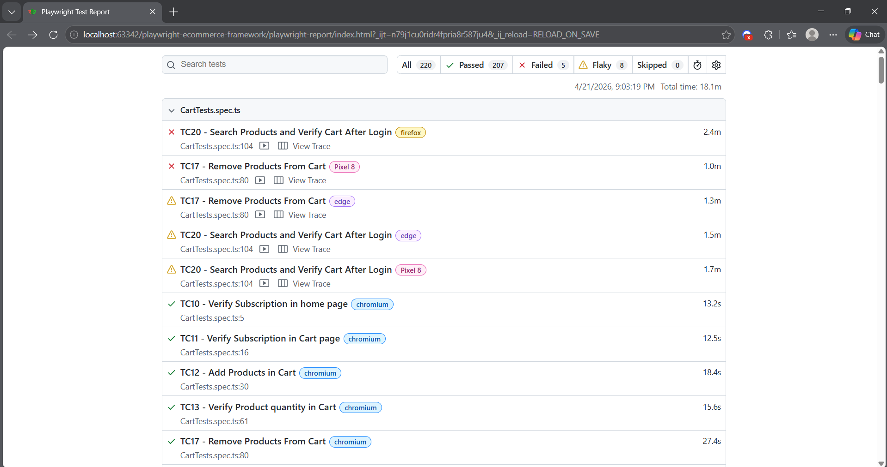
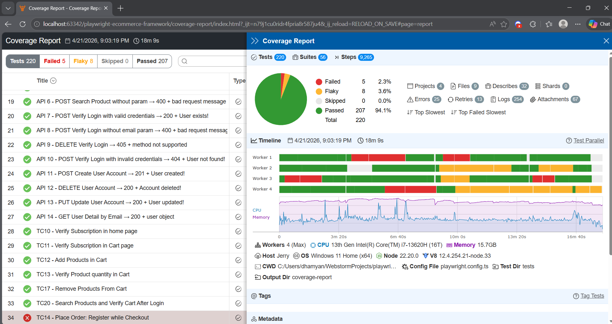
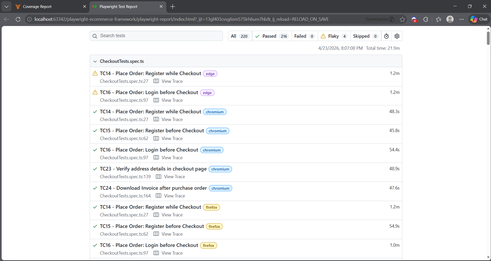
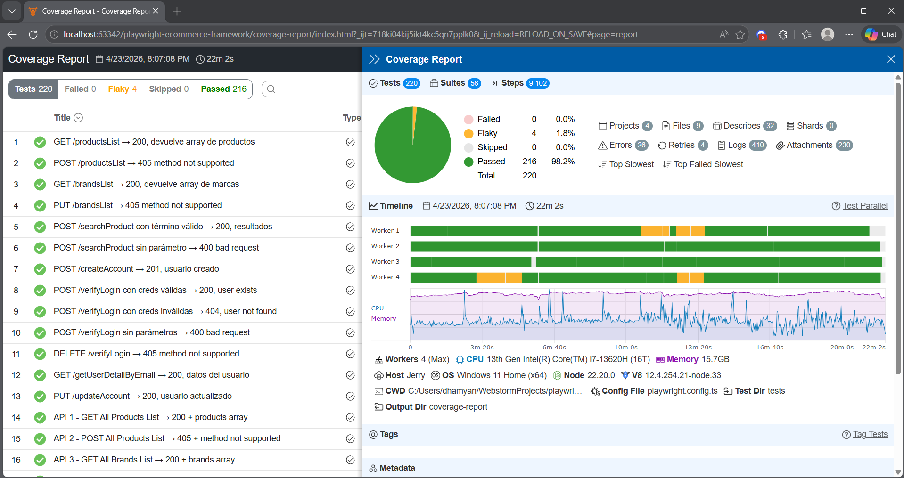

# 🎭 Playwright E-Commerce Test Framework


> Production-ready E2E test automation framework for e-commerce applications, built with Playwright and TypeScript following the Page Object Model pattern.

---

## 📋 Table of Contents

- [Overview](#overview)
- [Tech Stack](#tech-stack)
- [Architecture](#architecture)
- [Test Coverage](#test-coverage)
- [Flakiness Improvements](#-flakiness-improvements--before--after)
- [Getting Started](#getting-started)
- [Running Tests](#running-tests)
- [CI/CD Pipeline](#cicd-pipeline)
- [Design Decisions](#design-decisions)

---

## Overview

This framework automates **220 test executions** across **26 UI test cases + 14 API tests** covering the full e-commerce user journey — from account registration to checkout and order confirmation. It runs in parallel across **4 browsers and platforms** on every push to `main`.

Built to demonstrate real-world QA engineering practices: cross-browser compatibility, flaky test handling, environment-based configuration, and clean separation between test logic and page implementation.

---

## Tech Stack

| Tool | Purpose |
|------|---------|
| [Playwright](https://playwright.dev/) | Browser automation engine |
| [TypeScript](https://www.typescriptlang.org/) | Type-safe test implementation |
| [Monocart Reporter](https://github.com/cenfun/monocart-reporter) | Coverage & HTML reporting |
| [dotenv](https://github.com/motdotla/dotenv) | Environment configuration |
| [GitHub Actions](https://github.com/features/actions) | CI/CD pipeline |

---

## Architecture

```
playwright-ecommerce-framework/
├── .github/
│   └── workflows/
│       └── main.yml          # CI pipeline — parallel matrix across 4 browsers
├── pages/                    # Page Object Model layer
│   ├── BasePage.ts           # Abstract base: shared interactions, navigation, ad blocking
│   ├── HomePage.ts           # Header navigation, categories, newsletter, contact
│   ├── LoginPage.ts          # Login, signup, account creation full flow
│   ├── ProductsPage.ts       # Product listing, search, cart add with retry logic
│   ├── CartPage.ts           # Cart management, checkout, payment
│   └── config.ts             # Centralized URL and test data config
├── tests/                    # Test specs organized by feature
│   ├── LoginTests.spec.ts    # TC1–TC5, TC7: auth flows
│   ├── ProductsTest.spec.ts  # TC8–TC9, TC18–TC19, TC21: product & category tests
│   ├── CartTests.spec.ts     # TC10–TC13, TC17, TC20: cart operations
│   ├── CheckoutTests.spec.ts # TC14–TC16, TC23–TC24: checkout & payment
│   ├── ContactUsTests.spec.ts# TC6: contact form with file upload
│   ├── E2ETest.spec.ts       # Full shopping flow: register → browse → cart → order
│   └── ApiTests.spec.ts      # API smoke tests
├── fixtures/
│   └── fixtures.ts           # Custom Playwright fixtures (page objects DI)
├── helpers/
│   └── userHelpers.ts        # Reusable user creation and registration helpers
├── api/                      # API test utilities
├── utils/
│   ├── env.ts                # Environment variable handling with fallbacks
│   └── index.ts              # Shared utilities
└── playwright.config.ts      # Browser matrix, timeouts, reporters
```

### Key Design Patterns

**BasePage — shared navigation core**

All page objects extend `BasePage`, which provides:
- `clickAndNavigateTo(locator, urlPattern?)` — click + `waitForURL` with `networkidle`, eliminating cross-browser race conditions
- `blockAds()` — route-level ad and mixed-content blocking (prevents jQuery event listener failures on WebKit)
- `clickElement()` — smart click with automatic `force: true` fallback
- `waitForPageLoad()` — layered load state waiting

**Retry logic for unstable AJAX operations**

The target site uses jQuery-based AJAX for cart operations. When the modal confirmation doesn't appear (known intermittent behavior), `addToCartWithRetry()` retries up to 3 times with exponential backoff before failing with a clear error — instead of silently producing wrong cart counts.

**Environment-aware configuration**

All credentials and test data are read from environment variables with hardcoded fallbacks, making the framework runnable locally without any setup and in CI via GitHub Secrets.

---

## Test Coverage

### UI Tests

| Area | Test Cases | What's Covered |
|------|-----------|----------------|
| Authentication | TC1–TC5, TC7 | Register, login, logout, wrong credentials, duplicate email, test cases page |
| Navigation | TC6 | Contact form with file upload |
| Products | TC8, TC9, TC18, TC19, TC21 | Product detail, search, categories, brands, reviews |
| Cart | TC10–TC13, TC17, TC20 | Add/remove products, quantity, subscription, cart persistence after login |
| Checkout | TC14–TC16, TC23, TC24 | Register/login before or during checkout, address verification, invoice download |
| E2E | Full flow | Register → browse → review → add to cart → remove → checkout → pay → delete account |

### API Tests

Full REST API coverage against `automationexercise.com/api` — each test includes setup/teardown to remain fully isolated.

| Group | Test | Method | Endpoint | Asserts |
|-------|------|--------|----------|---------|
| Products | API 1 | `GET` | `/productsList` | 200 + products array non-empty |
| Products | API 2 | `POST` | `/productsList` | 405 + method not supported |
| Brands | API 3 | `GET` | `/brandsList` | 200 + brands array non-empty |
| Brands | API 4 | `PUT` | `/brandsList` | 405 + method not supported |
| Search | API 5 | `POST` | `/searchProduct` | 200 + results for valid term |
| Search | API 6 | `POST` | `/searchProduct` | 400 + missing param message |
| Verify Login | API 7 | `POST` | `/verifyLogin` | 200 + User exists (valid creds) |
| Verify Login | API 8 | `POST` | `/verifyLogin` | 400 + missing param |
| Verify Login | API 9 | `DELETE` | `/verifyLogin` | 405 + method not supported |
| Verify Login | API 10 | `POST` | `/verifyLogin` | 404 + User not found (invalid creds) |
| User CRUD | API 11 | `POST` | `/createAccount` | 201 + User created |
| User CRUD | API 12 | `DELETE` | `/deleteAccount` | 200 + Account deleted |
| User CRUD | API 13 | `PUT` | `/updateAccount` | 200 + User updated |
| User CRUD | API 14 | `GET` | `/getUserDetailByEmail` | 200 + user object with correct data |

---

## 📊 Flakiness Improvements — Before & After

One of the core engineering challenges in this project was identifying and eliminating test flakiness caused by the target site's infrastructure — not by the framework itself. The following results document that process.

### Before — Initial run (April 21, 2026)

> 220 tests · **207 passed · 5 failed · 8 flaky** · Total time: 18.1m




The 5 failures and 8 flaky tests were traced to three root causes, all originating in the target site:

| Root Cause | Affected Tests | Framework Response |
|-----------|---------------|-------------------|
| AJAX cart modal not appearing intermittently | TC17, TC20 | Implemented `addToCartWithRetry()` with exponential backoff |
| jQuery event listeners not firing cross-browser due to mixed HTTP content blocking | TC20 (Firefox) | Route-level blocking via `page.context().route()` |
| `waitForNavigation` race condition on slower browsers | TC17 (Pixel 8, Edge) | Replaced with `waitForURL` + `waitUntil: 'load'` |

### After — Post-fix run (April 23, 2026)

> 220 tests · **216 passed · 0 failed · 4 flaky** · Total time: 22.2m




**0 hard failures** in the post-fix run. The remaining 4 flaky tests are exclusively caused by intermittent network timeouts from the site itself (`ERR_CONNECTION_CLOSED`, AJAX drops under load) — conditions that are outside the framework's control and consistent with what other engineers automating the same site have reported.

> The framework includes `retries: 2` in CI configuration, which handles transient network failures without manual intervention.

---

## Getting Started

### Prerequisites

- Node.js 20+
- npm

### Installation

```bash
git clone https://github.com/jerryfinol17/playwright-ecommerce-framework.git
cd playwright-ecommerce-framework
npm ci
npx playwright install --with-deps
```

### Environment Setup

Create a `.env` file in the root (optional — all values have fallbacks):

```env
BASE_URL=https://www.automationexercise.com/
INCORRECT_USER=yourtest@test.com
INCORRECT_PASSWORD=wrongpassword
NEW_USER_NAME=Juan Carlos
NEW_USER_FIRST_NAME=Juan Carlos
NEW_USER_LAST_NAME=Bodoque
NEW_USER_ADDRESS1=123 Test Street
NEW_USER_COUNTRY=United States
NEW_USER_STATE=New York
NEW_USER_CITY=Konoha
NEW_USER_ZIPCODE=10001
NEW_USER_MOBILE=1234567890
NEW_USER_DAY=15
NEW_USER_MONTH=7
NEW_USER_YEAR=1995
```

---

## Running Tests

```bash
# Run all tests (all browsers in parallel)
npx playwright test

# Run a specific browser
npx playwright test --project=chromium
npx playwright test --project=firefox
npx playwright test --project=edge
npx playwright test --project="Pixel 8"

# Run a specific test file
npx playwright test tests/LoginTests.spec.ts

# Run a specific test by name
npx playwright test --grep "TC1"

# Open HTML report after run
npx playwright show-report
```

---

## CI/CD Pipeline

Every push and pull request to `main` triggers a parallel matrix across **4 browsers**:

| Browser | Platform |
|---------|---------|
| Chromium | Desktop |
| Firefox | Desktop |
| Edge | Desktop |
| Pixel 8 | Android (mobile) |

Each job uploads:
- **HTML Report** — Playwright's built-in test report
- **Monocart Report** — Coverage report with test metrics
- **Failure Artifacts** — Screenshots, videos, and traces on failure (retained 14 days)

> **Note on WebKit/Safari:** WebKit was excluded from the matrix due to a browser-level security restriction — WebKit blocks `window.location` navigation triggered programmatically via jQuery event listeners when mixed HTTP content is present on the page. This is a known limitation of the target site (`automationexercise.com`), not the framework. The framework is fully compatible with WebKit on sites that serve content over HTTPS correctly.

---

## Design Decisions

**Why `waitForURL` instead of `waitForNavigation`?**

`waitForNavigation` is deprecated in modern Playwright and has a race condition — it can miss navigations that start before it subscribes. `waitForURL` with `waitUntil: 'load'` waits for the specific destination URL and page load state, eliminating cross-browser flakiness (particularly on Firefox and mobile).

**Why route-level ad blocking?**

`automationexercise.com` serves ads and mixed HTTP content that delay jQuery initialization. Blocking these at the network layer via `page.context().route()` ensures jQuery event listeners are registered before any interactions occur.

**Why retry logic for cart operations?**

The site uses AJAX for cart additions. Under load or with slow connections, the AJAX response can be delayed or dropped, causing the confirmation modal to not appear. Rather than increasing timeouts (which slows all tests), the framework retries the action with exponential backoff (1s, 2s, 3s) before failing with a descriptive error.

---

## Author

**Jerry Finol** — QA Automation Engineer

[](https://github.com/jerryfinol17)